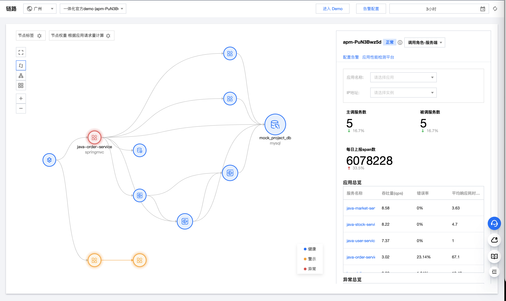
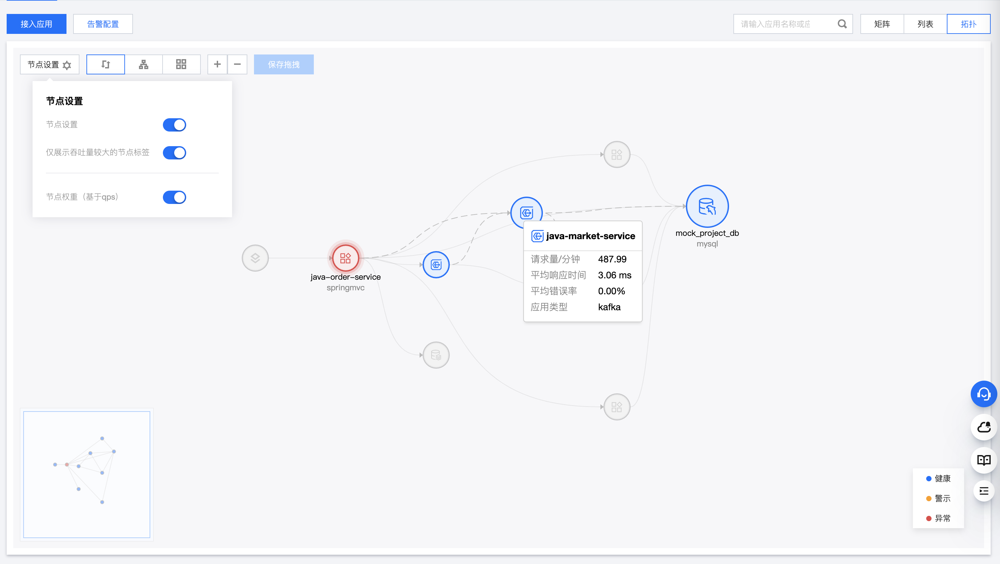
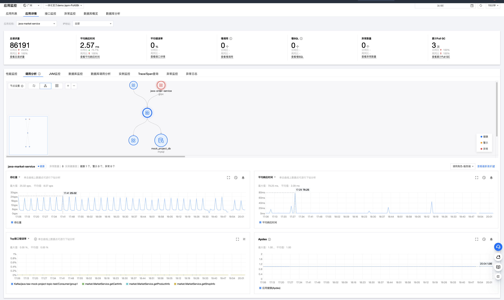
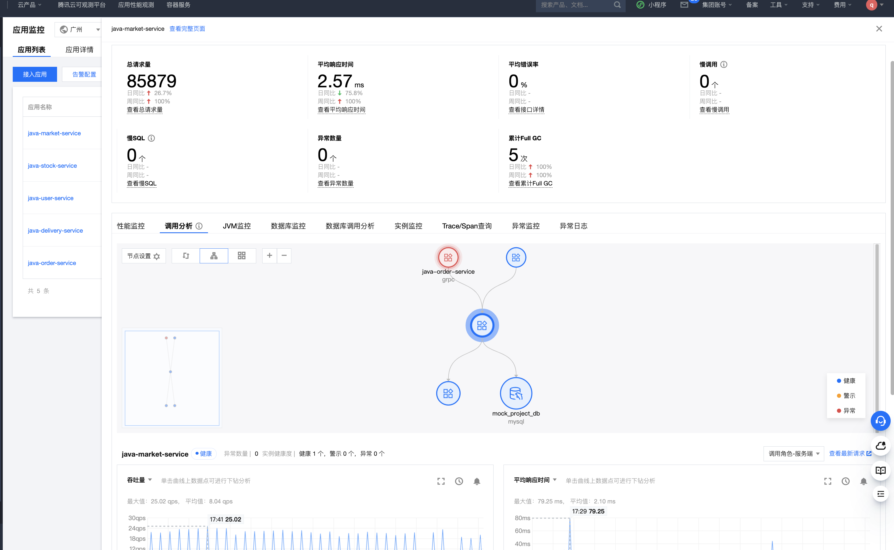
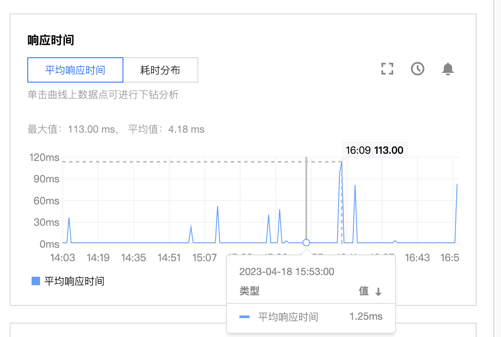
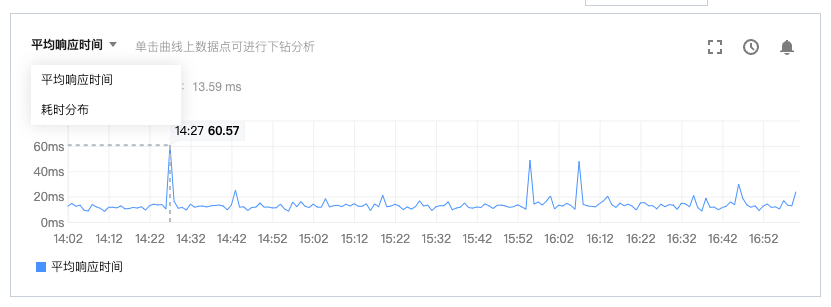
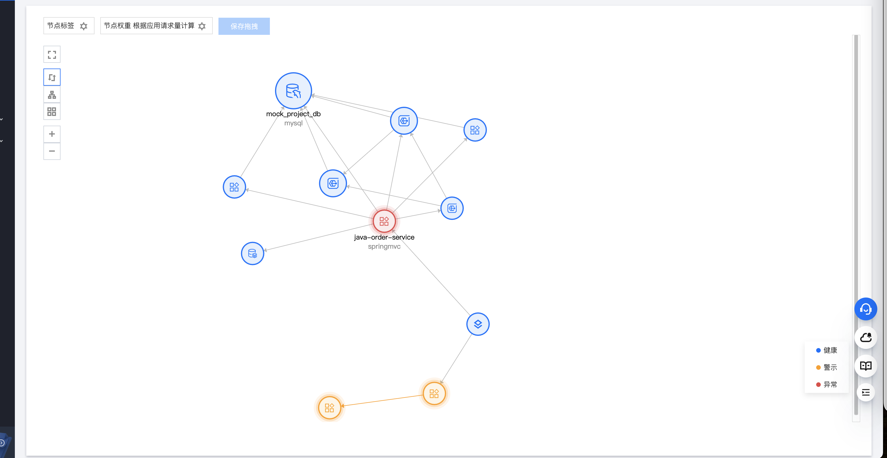

<!-- vscode-markdown-toc -->
	* 1. [页面功能布局优化](#)
		* 1.1. [一体化链路页](#-1)
		* 1.2. [应用监控页](#-1)
	* 2. [可视化体验优化](#-1)
		* 2.1. [图表（饼图、折线图、柱状图）](#-1)
		* 2.2. [拓扑图](#-1)
		* 2.3. [瀑布图](#-1)
	* 3. [React 代码分割](#React)

<!-- vscode-markdown-toc-config
	numbering=true
	autoSave=true
	/vscode-markdown-toc-config -->
<!-- /vscode-markdown-toc -->


###  1. <a name=''></a>页面功能布局优化
页面功能布局优化当前改动较大的是一体化链路页和应用详情页

####  1.1. <a name='-1'></a>一体化链路页
一体化链路页是用户查看接入业务系统的情况，如果用户没有业务系统上报数据的话，则展示接入页。如果有上报数据的话，该业务系统下所有应用调用链的性能情况。

优化前布局采用的是固定左右布局，左边展示应用拓扑图，右边展示业务系统、应用、调用链的性能情况，左右基本没有交互。

优化后的功能点：
+ 收缩节点标签功能点，节点标签设置都放在一个弹框中
+ 上下布局，上方模块展示应用拓扑图
+ 下方展示业务系统、应用的性能情况，可展开同时查看应用详细性能指标，可收起聚焦应用拓扑图
+ 下方模块可拖拽调整模块高度，最大高度**640px** 最小高度**200px**，首次拉到**200px**以下松开鼠标后固定到**200px**高度，第二次拉到**200px**以下就直接恢复收起状态
+ 当用户没有选中拓扑图中具体应用时，收起状态下，业务系统状态及其统计数据，包括主调服务树、被调服务数、每日上报span数；展开状态下，除展示业务系统相关情况，还展示业务系统的应用列表和异常情况，用户可通过选中引用列表中的应用，使拓扑图中应用的高亮该节点及其上下游节点和调用
+ 当用户选中具体应用时，收起状态下，只展示应用状态及其统计数据；展开状态下，除展示业务系统相关情况，还展示该应用的相关指标图表、上下游应用性能情况
+ 拓扑图的应用节点tooltip增加展示该应用类型图及其状态
+ 拓扑图的应用之间调用连线tooltip增加展示相关调用下钻链接和异常链接（调用异常时展示）
+ 业务系统或者应用的所有表格数据，都增加筛选、根据指标排序等功能

####  1.2. <a name='-1'></a>应用监控页
1. 布局调整，有部分用户投诉页面之间的跳转眼花缭乱。优化前，应用列表页、应用详情页、接口监控页、异常监控页、数据库概览、数据库分析这5个页面是单独页，页面之间的下钻跳转弹出新tab页供用户查看；优化后，将这5个页面收到应用监控下的tab页，路由地址没有变，将共有的部分抽出放到头部共享，页面之间的下钻跳转也是在同一个页面下tab页的切换，这样极大提升用户的使用体验
2. 应用列表页，新增点击应用名称列展开应用详情抽屉页，可看到该应用概览
3. 调整应用详情页布局，由上下布局改为左右布局

优化后：



###  2. <a name='-1'></a>可视化体验优化
可视化的展示在APM中包含饼图、折线图、柱状图、瀑布图，使用的组件是tea-charts。

####  2.1. <a name='-1'></a>图表（饼图、折线图、柱状图）
APM的主要功能是通过各种应用的指标来检测应用的性能情况，所有指标图表封装成一个组件，组件的功能包括了请求不同指标的数据、请求数据、图表类型、统计数据、对比数据，通过不同指标类型的入参配置来确定指标图表的展示。
 + 从设计层面看：
 优化前，组件标题不紧凑，内容不够丰富
 
 优化后，内容充实，提升用户体验
  

 + 从代码层面看：
优化前，由于开始组件设计问题，各种入参非常凌乱包括请求、图表设置、图例设置参数等，使用难、维护难、移植成本高。
优化后，研发同学只需要传入MetricType就可以使用内置的入参，学习成本低、可维护、移植成本低。

优化后：
```js
const Comp = ({onRefresh, onRefresh, loadTips, data}) => <MetricGraph
            metricType={MetricType.SPAN_TIME_CONSUMPTION}
            data={{ loadTips: loadTips === 'error' ? undefined : loadTips, sourceData: data.pieData }}
            className="span-time--graph"
            onRefresh={onRefresh} />         
```

####  2.2. <a name='-1'></a>拓扑图
使用的是tea-chart的拓扑图，把请求数据、拓扑图配置项、tooltip生成、交互功能都封装成一个组件，整站使用同一个拓扑组件。对其交互优化。
功能点：
+ 节点标签设置，是否展示标签、是否仅展示吞吐量较大的标签
+ 是否根据qps展示节点权重
+ 布局配置（左右树形、上下树形、弹性布局）
+ 放大、缩小
+ 保存、展示用户设置节点位置
+ 双击节点下钻进入应用详情页
+ 节点tooltip弹框展示应用类型、应用名、请求量、错误率、平均响应时间等，连线tooltip弹框展示客户端、服务端应用名、qps、错误率、平均耗时及调用查询链接等
+ 拓扑地图缩放
+ 增加hover节点事件，用户选择应用即触发hover该应用事件从而高亮上下游及展示该节点tooltip弹框

优化前：

优化后：


####  2.3. <a name='-1'></a>瀑布图

瀑布图在优化之前使用的是云组件的 table 与图表-瀑布图左右布局使用，hover table 的每行就需要对瀑布图进行 hover 操作。这种方案的好处是两个组件都很成熟，开发很方便。

缺点是：
1. 当数据超过 1000 条页面很卡顿，性能问题严重
2. 当前两种组件复合对比，操作存在延迟，左右拖拽交互不太好
3. 扩展瀑布图相关的功能困难，例如瀑布图展示展示图表不相关数据
   优化前：
   

调研竞品：

| 名称        | x 刻度轴 | 瀑布图信息展示扩展 | 图例展示 | 有无树形图 |
| ----------- | -------- | ------------------ | -------- | ---------- |
| 阿里云 arms | 无       | tooltip            | 无       | 有         |
| epsagon     | 整数刻度 | 图表内             | 无       | 有         |
| datadog     | 整数刻度 | tooltip            | 有       | 无         |

对于大数据的情况，竞品页面尚无 demo 供验证

1. 拆分刻度轴，将刻度轴拆分出来，放在 table 组件的 header
   
   相关刻度算法，比如取整刻度算法等，由图表库那边进行拆分
2. 拆分时长 bar，将刻度轴拆分出来，放在 table 组件的内容里
   
   相关算法：

   - 最长 bar 的宽度：max（[每个时间点的开始时长+持续时长, ......]）
   - 空白 bar 的宽度：当前 bar 的开始时长/最长 bar 宽度
   - 实际持续时长 bar 的宽度：当前 bar 的持续时长/最长 bar 宽度

3. 扩展信息的展示，可选择 tooltip 或者是 table 的单行向下延展
4. 关于 label 的展示，如果实际 bar 右边放不下时，可放在左边
5. 基于以上的全部使用 table 展示的情况，则可以使用虚拟滚动的技术方案，使得我们新能得以极大的提升，之前存在的超过 1000 条数据页面就会卡顿、难操作，现在都不存在了。甚至能支持超过 2w 条数据的瀑布图展示。

优化之后：


###  3. <a name='React'></a>React 代码分割

APM 页面及功能越来越多，代码体积越来越大，首屏延时较长，react 代码分割是我们亟需的。我们使用 webpack 工具打包代码，因此方案从 webpack 方向去进行总结。

1. 按照路由拆分

- 需要对加载页面报错是使用**ErrorBoundary、Suspense**提供错误捕捉、展示错误页面配置

```js
// app.ts
export const TapmContainer: React.FC = () => {
  const history = useHistory();

  return (
    <Provider store={store}>
      <ErrorBoundary>
        <Suspense
          fallback={
            <div>
              <LoadingTip />
            </div>
          }
        >
          <Router history={history}>
            <Demo />
            <TapmApp />
          </Router>
        </Suspense>
      </ErrorBoundary>
    </Provider>
  );
};
```

- 根据路由拆分并单独命名包，并懒加载包

```js
// TapmApp
import React, { useEffect } from 'react';
import { Switch, Route, Redirect, useLocation, useParams } from 'react-router-dom';

// webpackChunkName单独包的命名
const TeamIndex = React.lazy(() => import(/* webpackChunkName: 'TeamIndex' */ './team/Index'));

export const TapmApp: React.FC = () => (
  <Switch>
    <Route path="/monitor/access" exact component={MonitorAccess} />
  </Switch>
);
```

2. 缓存拆分 node_modules 公共代码库、业务公共组件
   使用**SplitChunksPlugin** 插件单独拆分 node_modules、业务公共组件

```js
module.exports = {
  optimization: {
    splitChunks: {
      chunks: 'all',
      maxInitialRequests: Infinity,
      minSize: 0,
      cacheGroups: {
        // 单独拆分node_modules
        vendors: {
          name: 'vendors', // 包名
          chunks: 'all',
          test: /[\\/]node_modules[\\/]/, // 匹配node_modules目录下的文件
          priority: -15, // 优先级配置项
          minChunks: 2, // 拆分前必须共享模块的最小 chunks 数
        },
        // 单独拆分业务公共组件
        default: {
          name: 'common', // 包名
          minChunks: 2, // 拆分前必须共享模块的最小 chunks 数
          priority: -20, // 优先级配置项
          reuseExistingChunk: true,
        },
      },
    },
  },
};
```

3. 使用外部扩展
   针对第三方不常变更版本的库使用外部扩展配置项，对其不打包，在页面 html 中增加 src 的引用方式

```html
<script src="http://cdn.staticfile.org/moment.js/2.24.0/moment.min.js" crossorigin="anonymous"></script>
```

```js
module.exports = {
  //...
  externals: {
    moment: 'moment',
  },
};
```

4. 对页面单独分析，动态引入组件

```js
const Comp = () => {
  const [Plant, setPlant] = useState({ Comp: null });
  useEffect(() => {
    import('./Plant').then((Plant) => {
      setPlant({ Comp: Plant.default });
    });
  }, []);

  return <>{Plant.Comp && <Plant.Comp method={method} team={currentTeam} showTapm={showTapm} />}</>;
};
```
