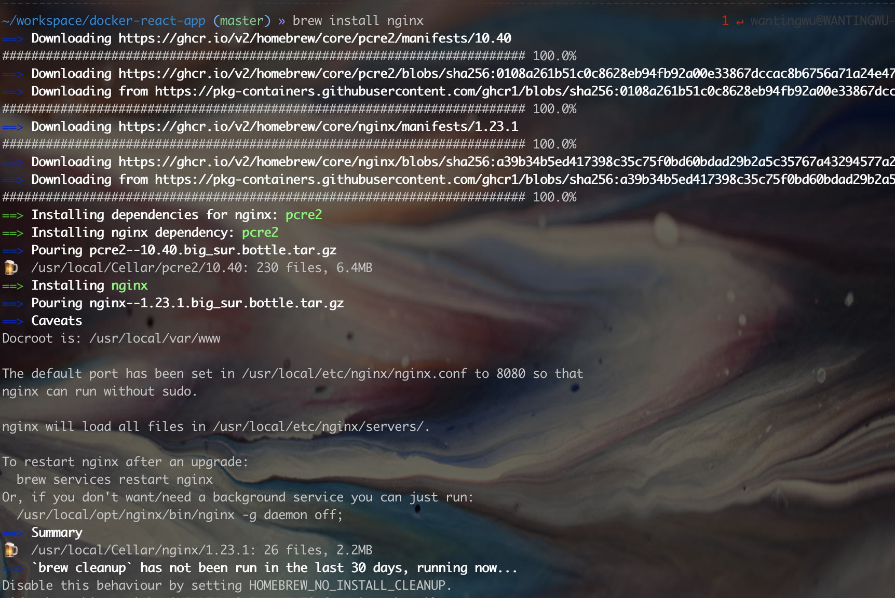

### mac安装使用nginx
##### 使用homebrew安装命令安装：
```shell
brew install nginx
```

##### 查看nginx配置信息
```shell
brew info nginx
```
默认服务端口8080，默认加载/usr/local/etc/nginx/servers/下所有文件

###### 启动nginx服务
启动服务：
```shell
sudo nginx
```
nginx从容停止命令，等所有请求结束后关闭服务
```shell
ps -ef |grep nginx
kill -QUIT  nginx主进程号
```
nginx 快速停止命令，立刻关闭nginx进程
```shell
ps -ef |grep nginx

kill -TERM nginx主进程号 
```
如果以上命令不管用，可以强制停止
```shell
kill -9 nginx主进程号
```

如果嫌麻烦可以不用查看进程号，直接使用命令进行操作
其中/usr/local/nginx/nginx.pid 为nginx.conf中pid命令设置的参数，用来存放nginx主进程号的文件
```shell
kill -QUIT `cat /usr/local/nginx/nginx.pid`
```

##### 常用命令

重新载入配置文件:
```shell
nginx -s reload
```
停止服务:
```shell
nginx -s stop
```
测试配置文件是否正确：
```shell
nginx -t  
```
等待工作进程处理完成后关闭:
```shell
nginx -s quit         
```
重启服务命令：
```shell
nginx -s reopen
```
查看nginx进程详细信息,包括pid、内存、用户名等：
```shell
ps aux | grep nginx
```
查看nginx启动端口占用情况：
```shell
lsof -i:9900
or
netstat -an | grep 9900

```
查看nginx服务是否在运行：
```shell
curl -I localhost:9900
```

##### 常见报错问题
1. 运行 nginx -s reopen 报错
```shell
nginx: [error] open() "/usr/local/var/run/nginx.pid" failed (2: No such file or directory)
```
解决方法：
```shell
# 为 Nginx 指定一个配置文件，来代替缺省的
nginx -c /usr/local/etc/nginx/nginx.conf 
nginx -s reload
nginx -s reopen
```

##### 虚拟主机配置

```nginx
server {
    listen          9901;
    server_name     localhost;
    #access_log      logs/default.access.log main;
    location / {
        index index.html;
        root  /Users/wantingwu/workspace/docker-react-app/build;
    }
}
```
+ 本地域名配置
  + 利用nginx的server_name实现域名跳转
  修改server :
```nginx
# a.conf
server {
   listen 80;
   server_name www.a.com;
   location / {
      root 项目地址
      index index.html index.htm
   }
}
# b.conf
server {
   listen 80;
   server_name www.b.com;
   location / {
      root 项目地址
      index index.html index.htm
   }
}
```
  + 修改hosts文件将域名指向本地IP
```
ip地址  www.a.com
ip地址  www.b.com
```
##### ssl证书配置

[1]nginx参考文档：https://blog.redis.com.cn/nginxchscommandline
[2]官方文档：https://nginx.p2hp.com/
[3]nginx参考文档：https://segmentfault.com/a/1190000022673232
