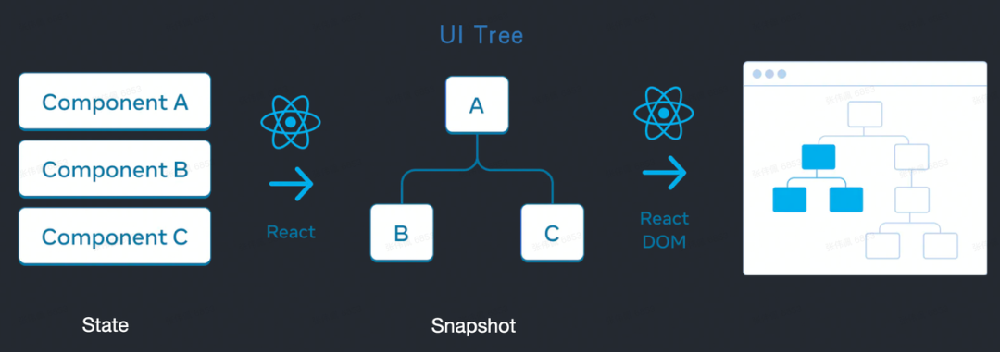
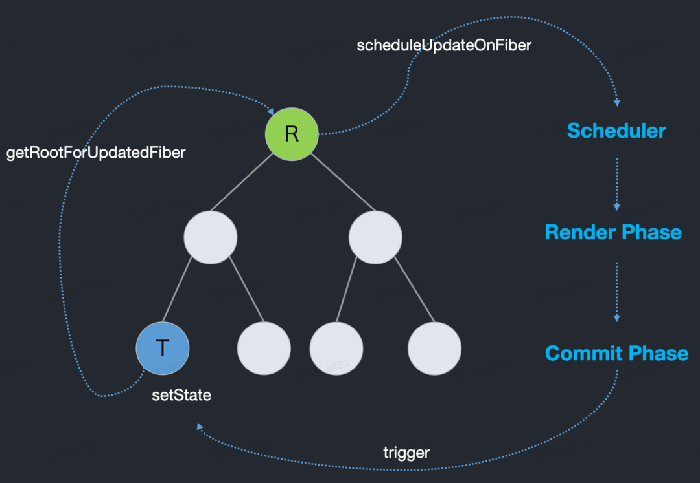
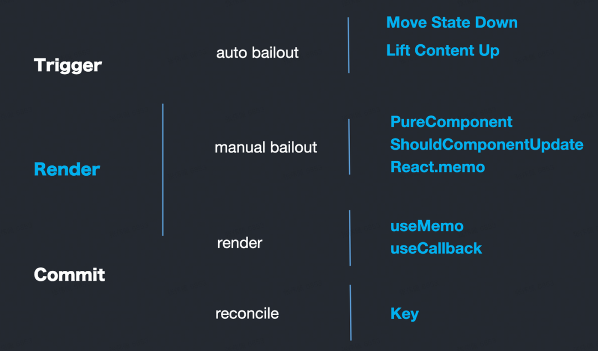
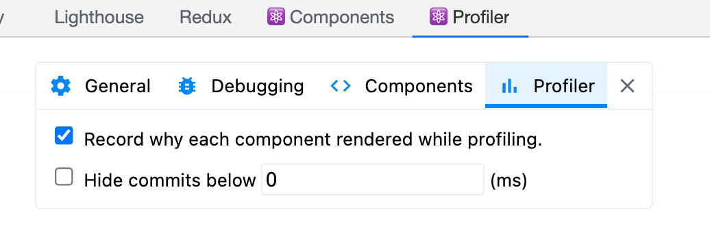
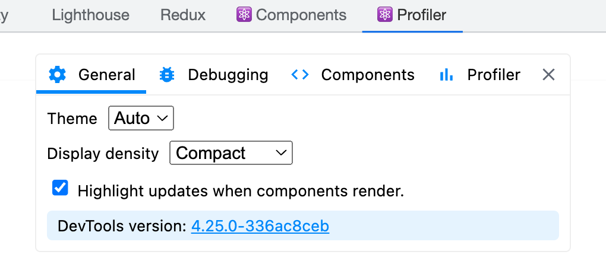

## 深度解析 React 性能优化 API

以下文章来源于字节前端 ByteFE ，作者张伟佩

---

性能优化一直是前端领域讨论的一个热门问题，但在平时沟通及 code review 过程中发现很多人对于 React 中性能优化理解很模糊，讲不清楚组件什么时候更新，为什么会更新，关于 React 性能优化的文章虽然比较多，但大多数都是在罗列一些优化的点，本文将以 React 底层更新过程为基础，层层递进，将性能优化相关的用法、原理串联起来，让读者真正理解为什么需要性能优化以及如何使用。

#### 更新流程

React 使得前端开发者不再跟 DOM 打交道，只需要控制组件及其状态来完成应用开发。React **在这背后做的最主要的工作就是保持组件状态与用户界面的一致性**：将组件状态构建成用于描述用户界面的 UI Tree(或者叫 Virtual Dom)并反应到浏览器中，这也是 React 更新的一个最宏观的过程。


我们向下一层，看一下当更新发生时的具体过程。

如下图所示，假设用户蓝色的节点中发生了一次 onClick，对应组件触发了相应 setState，React 就会重新开始构建整颗 UI Tree。因为构建都是从根节点发生的，所以会先调用*getRootForUpdateFiber*找到根节点，并触发*ScheduleUpdateOnFiber*进入*Scheduler*进行调度开始更新过程；更新主要分为两个阶段，*Render Phase*和*Commit Phase*，其中：

+ Render 阶段就是根据每个组件中的状态构建出一个新的 UI Tree，也叫WorkInProgress Tree，并为每一个结点对应的操作打上 EffectTag，即更新、删除、新增。全部构建完成后就进入下一阶段。
+ Commit 阶段就是将构建好的 WIP Tree 反应到浏览器中，即 React 为我们自动进行相应的 dom 操作，保持 UI 一致性。
  
当提交完成后，实际上一次更新就完成了，用户可以进行交互，可能又会触发新的更新，从而循环这个过程。



上图的这个过程，实际上就是 React 更新的核心 Loop。开发者或者是 React 团队本身所做的所有关于性能优化的事情，本质上都是通过加速这个 loop 的过程，从而实现用户界面的高响应。比如 Scheduler 中 Time Slice 机制实际上就是减少每次循环的工作量，当然这个过程对我们开发者是无感的，不再详细展开，我们今天重点的关注是作为开发者，如何加速这一过程，也就是实现性能优化。

#### 如何加速

这里我们再向下一层，看一下 Render 阶段到底是如何构建 UI Tree 的。因为结点会组成一个树结构，所以构建的过程本身是一个遍历的过程，每个阶段结点都会经历*beginWork*和*completeWork*，大致遍历过程如下图所示：

> 遍历过程并非本篇重点，过程有简化


1. 默认优化策略

然而对于一个实际的应用来说，涉及节点众多，而实际一个用户操作，往往只会影响个别的节点，如果挨个遍历，全部重新构建一遍显然会有些浪费，当然 React 自己也知道这件事，具体是怎么优化的呢？

我们干脆再深入一层，直接到源码看看 React 在*beginWork*里都做了些什么：

> 为方便读者理解，源码有一定程度简化
```js
// ReactFiberBeginWork.new.js
function beginWork(current, workInPrgress, renderLanes) {
    // 检查props和context是否发生改变
    if (oldProps !== newProps || hasLegacyContextChanged()) {
       didReceiveUpdate = true;
    } else {
       // props或者context都未改变的时候，检查是否有pending中的update
      const hasScheduledUpdateOrContext = checkScheduledUpdateOrContext(
        current,
        renderLanes,
      );

      if (!hasScheduledUpdateOrContext) {
        didReceiveUpdate = false;
        // 当前Fiber可以复用，进入bailout流程
        return attemptEarlyBailoutIfNoScheduledUpdate(current, workInProgress, renderLanes);
      }
    }
    // 无法bailout，真正进入beginWork流程
}
```

**代码中关于这部分可以看到名称叫*LegacyContext*，所以这里的 context 实际上是指旧版的 context，新版的 context 是否发生变化实际上会反应到*pending update*中，但这里直接理解成 context 并不影响本文内容，因此不再展开。**

可以看到，React 在真正进入 beginWork 构建之前，实际上会有一层逻辑判断，这就是 React 自带的性能优化策略。对于那些p*rops state（pending update) context*没有发生变化的结点会进入*bailout*流程，中文翻译过来为“急救”，可以简单理解成这个结点没有发生变化，还可以抢救一下，没必要让他重生。

我们再进一步看看*attemptEarlyBailoutIfNoScheduledUpdate*里面做了什么，核心其实下面这个方法，主要是看子节点*state*是否发生变化，如果没有，直接返回null，代表当前节点的子树都可以*bailout*，也就是跳过构建。

```js
function bailoutOnAlreadyFinishedWork(
  current: Fiber | null,
  workInProgress: Fiber,
  renderLanes: Lanes,
): Fiber | null {
  // 检查下children是否有pending work
  if (!includesSomeLane(renderLanes, workInProgress.childLanes)) {
    return null
  }

  // 当前结点无任务工作要做，但是子树有，克隆子结点，继续Reconciler的过程
  cloneChildFibers(current, workInProgress);
  return workInProgress.child;
}
```
**思考：为什么看子树有没有发生变化时为什么没有比较 props？**

到这里我们就搞明白了 React 自带的性能优化策略，简单概括下如下：


接下来我们看一个非常简单的 demo，思考一下当点击 update 按钮时，Child中的"child render"会被打印吗：
```js
const Child = () => {
  console.log('child render');

  return <div>I am child</div>;
};

export default function App() {
  const [count, setCount] = useState(0);

  return (
    <>
        <button onClick={() => setCount(count + 1)}>update</button>
        <Child />
    </>
  );
}
```

根据我们刚才的分析，当*Child*组件进入*beginWork*流程时，因为 *props state context* 都没有变，应该会被跳过，即走*Bailout*流程才对。但是实际上可以看到每次点击，*Child*组件都会重新渲染，这是为什么呢？


让我们带着疑问，直接到源码里面调试一下：


可以看到，*Child*组件确实没有满足 React 默认优化策略的条件，而不满足的原因是**props 发生了变化**。

我们知道，JSX本质上是*React.createElement*的语法糖，所以调用*Child*的地方（App 组件内），本质上是调用*React.createElement*，传递的 props 为一个空对象，App 两次渲染传递给子组件的 props 并不相等 *{} !== {}*。

```js
export default function App() {
  const [count, setCount] = useState(0);

  return (
    <>
        <button onClick={() => setCount(count + 1)}>update</button>
        {React.createElement('Child', {})}
        <Child />
    </>
  );
}
```
2. 手动跳过构建

既然*Child*与状态*count*无关，理论上来讲肯定是可以被跳过的重新渲染呢，怎么做呢？这里就要引入第一个性能优化 API *React.memo*，如下面的例子通过*memo*包裹来组件之后，发现这时候点击后，*Child*不会再重新渲染了。
```js
const Child = memo(() => {
  console.log('child render');

  return <div>I am child</div>;
});

export default function App() {
  const [count, setCount] = useState(0);

  return (
    <>
        <button onClick={() => setCount(count + 1)}>update</button>
        <Child />
    </>
  );
}
```
我们直接进入源码中看看memo到底做了什么：

> 类似效果的 API 还有 PureComponent 、ShouldComponentUpdate，由于现在基本都已经拥抱函数式组件，此处以 memo 为例。

```js
function updateSimpleMemoComponent(
  current: Fiber | null,
  workInProgress: Fiber,
  Component: any,
  nextProps: any,
  renderLanes: Lanes,
): null | Fiber {
    const prevProps = current.memoizedProps;
    // 使用浅比较代替了全等比较
    if (shallowEqual(prevProps, nextProps)) {
       didReceiveUpdate = false;
    }
    // 检查是否有pending的更新
    if (!checkScheduledUpdateOrContext(current, renderLanes)) {
        return bailoutOnAlreadyFinishedWork(
          current,
          workInProgress,
          renderLanes,
        );
    }

    // 无法bailout, 即进入render阶段
    return updateFunctionComponent(
        current,
        workInProgress,
        Component,
        nextProps,
        renderLanes,
      );
}
```

从源码中我们可以看到，当自动bailout不满足时，memo实际上提供了另一条路径进入bailout，而要求跟默认优化策略非常类似，唯一的区别是第 10 行，用shallowEqual替换了原先的 props 全等比较。而对于我们上面 demo 的情况，由于新旧 props 都是空对象，因此通过浅比较就满足了优化策略，从而跳过了构建过程。

**思考：那是不是给每个组件都包裹一下 memo，来尽可能的命中 bailout？**

3. 第三条路

上面的问题显然答案是否定的，因为如果是的话，那 React 为什么不直接默认给所有组件都包裹一下，还需要开发者手动来不是多此一举么？

不这么做的原因是，*memo*并不是免费的，*shallowEqual*会去挨个遍历 props 并进行比较，这个成本可要比全等大多了，那有没有办法不使用*memo*又能命中*bailout*的第三条路呢，这里给大家介绍两种方式：

+ Move state down - 状态下放

还是拿刚才那个例子，我们可以看到 App 组件更新的原因是内部的*count*发生了变化，而*Child*虽然跟*count*没有任何关系，但是由于同属于一个组件，也被带着重新渲染了。

```js
const Child = () => {
  console.log('child render');

  return <div>I am child</div>;
};

export default function App() {
  const [count, setCount] = useState(0);

  return (
    <>
        <button onClick={() => setCount(count + 1)}>update</button>
        <Child />
    </>
  );
}
```

我们稍微改造一下，把*count*及其相关的逻辑抽离到另外一个子组件*Counter*中：

```js
const Child = () => {
  console.log('child render');

  return <div>I am child</div>;
};

const Counter = () => {
  const [count, setCount] = useState(0);

  return <button onClick={() => setCount(count + 1)}>update</button>;
}

export default function App() {
  return (
    <>
        <Counter />
        <Child />
    </>
  );
}
```

可以实际测试一下上面的代码，虽然只是简单调整了一下组件结构，*Child*居然不再重新渲染了。

原因就在于变化的内容现在在*Counter*内部，*App* 组件会由于满足了默认的性能优化策略不再重新渲染，因此传递给*Child*的props就不会发生变化，从而*Child*也就满足了默认的性能优化策略，这种逻辑是具有传递性的，即如果*Child*还有子组件，也会因为*Child*没有重渲染，继续满足默认性能优化策略而都被跳过。

大家是否有听说过这样的建议**要避免大组件，将组件的粒度控制要尽可能的细**。

在 React 中，组件本质上就是函数，函数有单一职责原则，组件也适用。想必通过上面的例子，我们对于这句话能有更深的理解，这么做不仅仅是便于维护，而是会直接影响到性能优化。

+ Lift content up - 内容提升
当然也有状态下放不适用的情况，比如但是当遇到下面这个 case，*Child*的外层 div 中也用到了*count*，如果将*Child*全部拆分过去到*Counter*中，实际*Counter*变化，*Child*还是会重新渲染，这时候就可以用另外一种方法 内容提升：
```js
const Child = () => {
  console.log('child render');

  return <div>I am child</div>;
};

export default function App() {
  const [count, setCount] = useState(0);

  return (
    <div classname={count}>
        <button onClick={() => setCount(count + 1)}>update</button>
        <Child />
    </div>
  );
}
```
简而言之就是虽然将*Child*拆分到*Counter*中，但是*Child*得渲染不依赖任何*Counter*的内容，可以将*Child*提升到*App*中，以children的方式进行传递：

```js
const Child = () => {
  console.log('child render');

  return <div>I am child</div>;
};

const Counter = ({children}) => {
  const [count, setCount] = useState(0);

  return (
      <div classname={count}>
        <button onClick={() => setCount(count + 1)}>update</button>
        {children}
       </div>
   );
}

export default function App() {
  return (
      <Counter>
          <Child />
      </Counter>
  );
}
```

通过上面这种方式，其实*Child*也不会重新渲染，调试一下看看*Counter*的 props，发现*children*实际上就是*Child*，能看到两次渲染*Child*内容并没有变。


原因是*Child*现在是作为*Counter*组件的 props，props 的内容是在App组件中传递的，因此可以理解成*Child*依然是直接依赖于App组件，由于App没有重新渲染，因此*Child*也满足了默认的性能优化策略。

+ 跳过局部构建

通过上面的内容，我们知道了每次更新时会去重新构建组件树，当然我们也可以通过命中*bailout*来避免组件重新构建，但组件内确实发生了状态变化就无法*bailout*，这时候就会进入一个组件的 render 阶段：

```js
function updateSimpleMemoComponent(
  current: Fiber | null,
  workInProgress: Fiber,
  Component: any,
  nextProps: any,
  renderLanes: Lanes,
): null | Fiber {
    // ...

    // 无法bailout, 即进入render阶段
    return updateFunctionComponent(
        current,
        workInProgress,
        Component,
        nextProps,
        renderLanes,
      );
}
```
跟随代码继续走我们可以看到 render 阶段实际上就是调用组件的渲染方法：
```js
export function renderWithHooks(
  current: Fiber | null,
  workInProgress: Fiber,
  Component: (p: Props, arg: SecondArg) => any,
  props: Props,
  secondArg: SecondArg,
  nextRenderLanes: Lanes,
): any {
  // ...

  let children = Component(props, secondArg);

  // ...
}
```
到这里就要轮到两个性能优化的 API 出场了：*useMemo* *useCallback* ，背后的逻辑是如果一个组件必须重新绘制时，我们可以尽可能加速这个绘制的过程。

*useMemo*的基本用法相关资料很多，这里不再赘述，重点说明下使用*useMemo*的两种场景：

+ 避免耗时的逻辑重复计算
如下面的例子所示，*heavyCalc*是一个耗时比较严重的逻辑运算，我们期望与 state2 无关的 reRender 能够跳过这次运算，通过*useMemo*包裹*heavyCalc*能够实现只有当 state2 变化时才重新计算 val。

```js
const Comp = () => {
    const [state1, setState1] = useState();
    const [state2, setState2] = useState();

    const val = heavyCalc(state2);

    return （
      // ...
    );
}
```

+ 防止子组件的缓存击穿
list 由于是*Child*组件的 props，而每次*Comp*更新都会生成一个全新的对象，这会导致*Child*即使使用了性能优化策略，如使用*React.memo*也无法命中*bailout*，而通过*userMemo*返回 list，可以实现每次渲染都返回同一个值。
```js
const Comp = () => {
    // ...

    // 通过缓存这个值来避免子组件memo失效
    const list = []

    return （
      // ...
      <Child list={list} />
    );
}
```
*useMemo*是如何做到的呢，我们直接看看源码：

```js
function updateMemo(nextCreate, deps) {
  // ...
  const prevDeps: Array<mixed> | null = prevState[1];
  // 对于数组中的每一项全等比较
  if (areHookInputsEqual(nextDeps, prevDeps)) {
    return prevState[0];
  }
  // 调用函数返回新创建的值
  const nextValue = nextCreate();
  hook.memoizedState = [nextValue, nextDeps];
  return nextValue;
}
```

实现比较简单，最关键的就是第四行，做的事情就是将依赖项中的每一个挨个和上一次渲染时传递的依赖项进行全等比较，如果都没有发生变化，直接将存储的缓存值进行返回，否则重新计算。

那我们再看看，顺便看看*useCallback*的实现：
```js
function updateCallback(callback, deps) {
  // ...
  const nextDeps = deps === undefined ? null : deps;
  const prevState = hook.memoizedState;
  // 对于数组中的每一项全等比较
  const prevDeps: Array<mixed> | null = prevState[1];
  if (areHookInputsEqual(nextDeps, prevDeps)) {
    return prevState[0];
  }
  // 直接返回callback
  hook.memoizedState = [callback, nextDeps];
  return callback;
}
```
可以看出，两者唯一的区别在于一个存储函数的本身*(useCallback)* 一个存储函数返回的值*（useMemo)*。

从实现上我们其实能看出*useCallback*中不包含任何运算逻辑，因此使用场景要比*useMemo*更少，只适用于第二种场景，即防止子组件的缓存击穿，通过将父组件中声明的回调函数进行缓存来保持子组件 props 的不变。

```js
const Comp = () => {
    // ...

    // 通过缓存这个值来避免子组件memo失效
    const handleClick = useCallback(() => {}, []);

    return （
      // ...
      <Child onClick={handleClick} />
    );
}
```

#### 总结和建议

先简单回顾一下整体的更新逻辑：当用户触发更新操作时，

+ React 会首先尝试应用默认的性能优化策略尝试对组件进行bailout，这一阶段我们在编码过程中可以尽可能的应用状态下放和内容提升满足默认性能优化策略条件提高bailout命中率。
+ 默认bailout不满足时，我们也可以使用像PureComponent ShouldComponentUpdate React.memo 来降低匹配条件，再次进行bailout。
+ 当必不可少的需要重新渲染时，我们可以使用useMemo useCallback来减少渲染的时间。

当全部渲染完成后，实际上就构建好了一颗新的 UI Tree，React 会去对比新旧两颗 Tree 来找出需要对哪些 dom 结点进行何种操作，这个过程也被称为reconcile，大家比较熟悉的diff算法就是发生在这里，但是作为开发者这一做的事情很有限，我们唯一可以做的事是在通过循环添加组件时，注意为组件添加有效的key，来让 React 进行 diff 的时候少做一些比较，减少不必要的 dom 操作。


了解这些性能优化的手段后，迫不及待在自己的组件中整改一顿？这边的建议是注意**不要过度优化**。

为什么这么说呢？

+ 一方面我们能够发现useMemo和useCallback本身也不是免费的，需要开辟空间去存储依赖并且每次都要去比较。
+ 另外，从实际的开发体验上，在组件中大量使用useMemo和useCallback，会导致代码比较臃肿可读性变差，对开发者心智要求比较高，维护依赖项。
 
我们要知道 React 本身的性能优化已经做的很好了，正确的逻辑应该是当实际性能问题发生时，我们需要去定位发生问题的组件，再应用上文提到的性能优化方法进行优化。

最后出现性能问题时的组件定位，这边推荐一下React Profiler[1]，相关文档比较清楚这边不再赘述，简单分享些小 tips，可以勾一下这两选项，可以方便的看到组件重新渲染的原因和操作时发生重新渲染的组件。



参考资料
[1] React Profiler: https://reactjs.org/blog/2018/09/10/introducing-the-react-profiler.html
[2] React Forget: https://www.youtube.com/watch?v=lGEMwh32soc
[3] Dicuss on useMemo&useCallback: https://www.joshwcomeau.com/react/usememo-and-usecallback/
[4] Before you memo: https://overreacted.io/before-you-memo/


