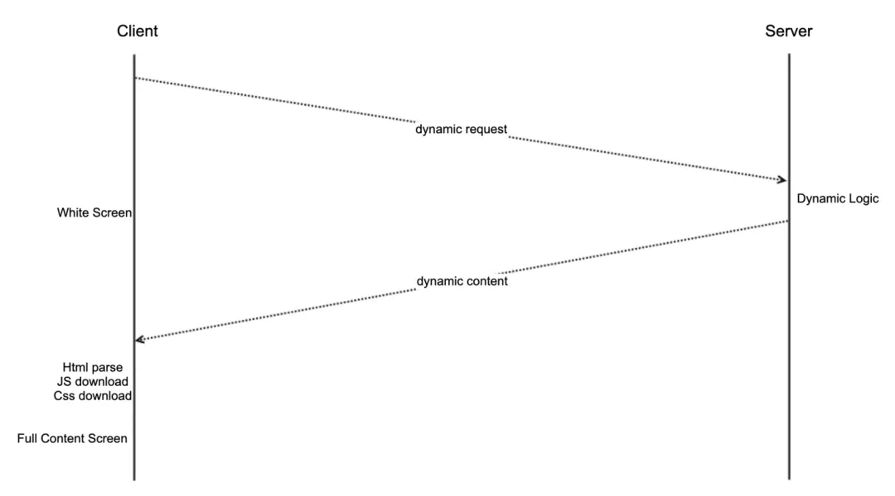
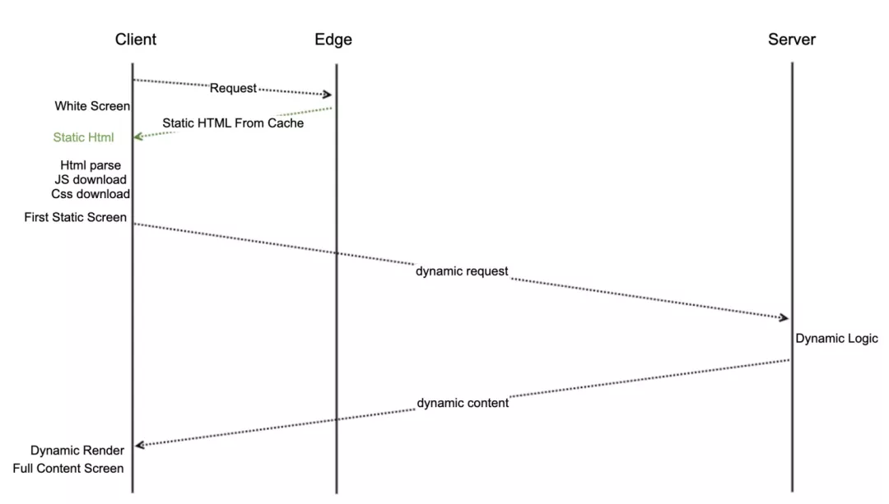
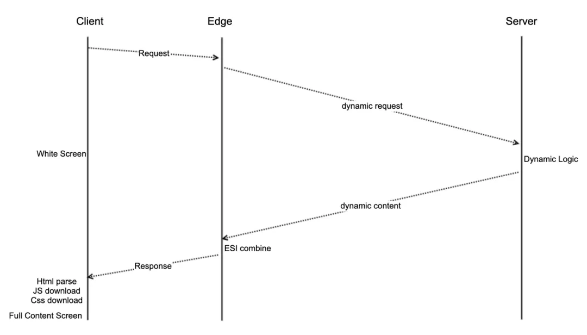
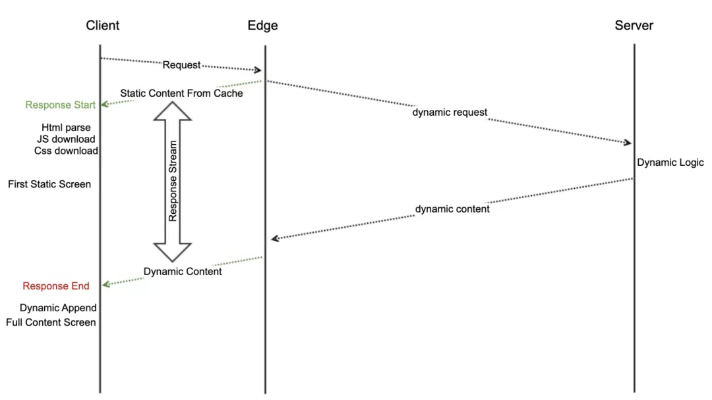
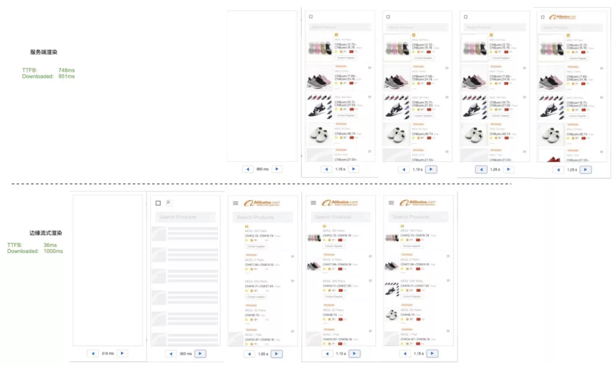
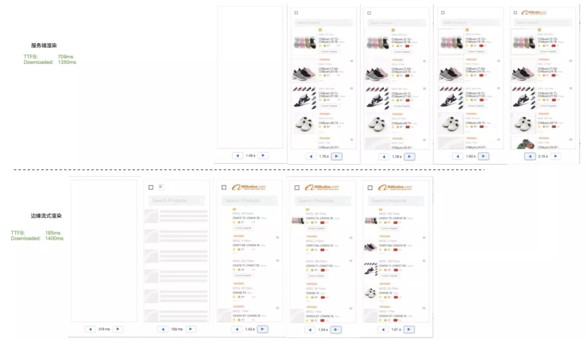
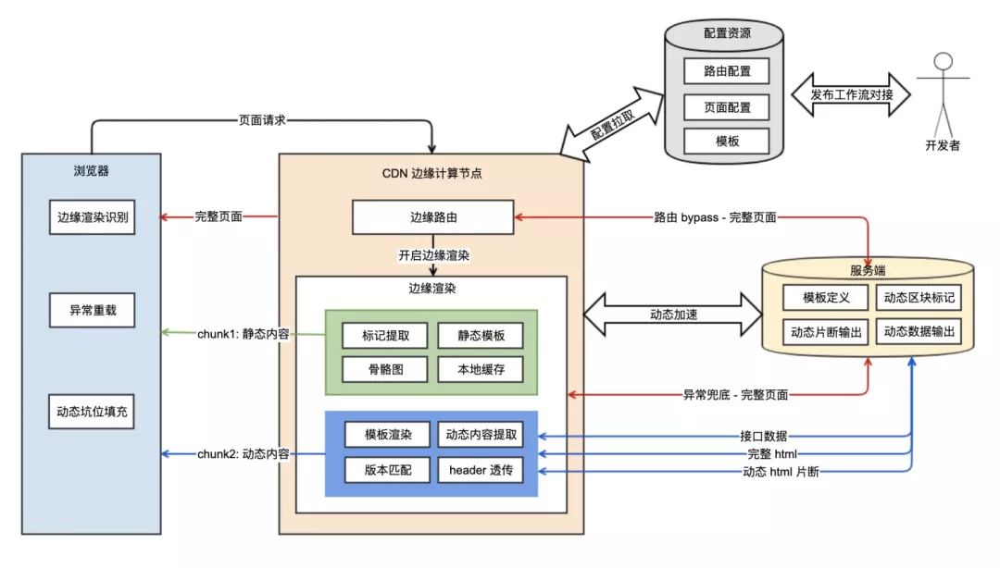

https://developer.aliyun.com/article/762599

## 前端性能优化：当页面渲染遇上边缘计算

#### 背景
对于web页面来说，*首跳页面场景*（例如SEO、付费引流）的性能普遍比二跳性能要差。原因主要是首跳用户无法使用连接复用和浏览器缓存。首跳场景在端上的优化手段（预加载，预执行、预渲染等）无法实施。

#### 首跳场景下的优化思路
##### 思路一：SSR
直接通过服务端渲染（SSR）,将首屏动态内容从服务端输出。



优点：一次性返回html页面的主体内容，不用通过请求接口数据用js渲染页面内容；
缺点：对于距离服务端远，或者服务端处理时间长的场景，需要等服务器处理完内容之后返回，即使返回html，还需要加载完js、css等静态资源后，才能看到内容，*白屏时间长*。

##### 思路二：CSR + CDN
利用CDN边缘缓存能力，把html的静态框架部分缓存只CDN上，让用户能快速看到部分内容，通过异步请求获取动态内容部分并渲染（CSR），从而减少白屏时间。CSR + CDN时序图：



优点：用户可以快速看到部分页面内容，白屏时间更少；
缺点：最终有意义的动态内容展示的时间比SSR更长。

##### 思路三：ESI
CSR+CDN可以减少白屏时间，但是动态内容展示时间过长。分析其原因是，用户需要先发起获取html静态框架请求，之后开始发起异步请求获取动态内容，这两个操作是串行的，且串行的过程中还穿插着js的下载和执行。

那么如何利用CDN把静态内容和动态内容整合起来呢？

ESI (Edge Side Include) 给了我们一个很好的思路启发，ESI 最初也是 CDN 服务商们提出的规范，可通过 html 标签里加特定的动态标签，可让页面的静态内容缓存在 cdn 上，动态内容可以自由组装。ESI 的渲染时序图如下：



ESI可以把静态部分缓存在CDN,动态部分会在用户请求时会动态请求和拼接。但是ESI模式下，最终返回给用户的首字节，还是要等到所有动态内容在CDN上都获取和拼接完成。也就是说没有减少白屏时间，只是减少了CDN和服务器之间内容传输的体积，带来的性能收益很小。最终效果和SSR区别不大。

虽然ESI的效果不符合预期，但是有了思考的方向。如果能把ESI改造成可以先返回静态内容，动态内容在CDN节点获取到之后再返回给页面，就可以保证*白屏时间短*且*动态内容返回不推迟*。如果要实现类似流式ESI效果，要求在CDN上能对请求进行细粒度的操作，已经流式的返回。CDN节点支持复杂运算吗？-- *边缘计算*。我们可以在CDN上做类似于浏览器的service worker操作，对请求和响应做灵活的变成。

----

**基于边缘计算能力，得出一个新方案：边缘流式方案（ESR）。方案详情：**

#### 渲染流程
方案的核心思想是，借助边缘计算的能力，将静态内容与动态内容以流式的方式，先后返回给用户。cdn 节点相比于 server，距离用户更近，有着更短的网络延时。在 cdn 节点上，将可缓存的页面静态部分，先快速返回给用户，同时在 cdn 节点上发起动态部分内容请求，并将动态内容在静态部分的响应流后，继续返回给用户。最终页面渲染的时序图如下：



从上图可以看出，cdn 边缘节点可以很快地返回首字节和页面静态部分内容，然后动态内容由 cdn 发起向 server 起并流式返回给用户。方案有以下特点：

首屏 ttfb 会很短，静态内容（例如页面 Header 、基本结构、骨骼图）可以很快看到。
动态内容是由 cdn 发起，相比于传统浏览器渲染，发起时间更早，且不依赖浏览器上下载和执行 js。理论上，最终 reponse 完结时间，与直接访问服务器获取完整动态页面时间一致。
在静态内容返回后，已经可以开始部分 html 的解析，以及 js, css 的下载和执行。把一些阻塞页面的操作提前进行，等完整动态内容流式返回后，可以更快地展示动态内容。
边缘节点与服务端之间的网络，相比于客户端与服务端之间的网络，更有优化空间。例如通过动态加速，以及 edge 与 server 之间的连接复用，能为动态请求减少 tcp 建连和网络传输开销。以做到最终动态内容的返回时间，比 client 直接访问 server 更快。

#### demo 对比

目前在 alicdn 上对主搜页面做了一个 demo （https://edge-routine.m.alibaba.com/）, 下面是在不同网络（通过 charles 的 network throttle 配置限速）情况下，与原始页面的加载对比：

**不限速（wifi）**


**限速 4G**


**限速 5G**


从上面结果可以看出，在网速越慢的情况下，通过 cdn 流式渲染的最终主要元素出来的时间比原始 ssr 的方式出来得越早。这与实际推论也符合，因为网络越慢，静态资源加载时间越慢，对应的浏览器提前加载静态资源带来的效果也越明显。另外，不管在什么网络情况下，cdn 流式渲染方式的白屏时间要短很多。

#### 整体架构
##### 架构图

##### 边缘流式渲染
+ 模板
  
模板就是一个类似于包含 ESI 区块的语法，基于模板，会将需要动态请求的内容提取出来，把可以静态返回的内容分离出来并缓存起来。所以模板本质上定义了页面动态内容和静态内容。

在流式渲染过程中，会从上到下解析页面模板，如果是静态内容，直接返回给用户，如果遇到动态内容，会执行动态内容的 fetch 逻辑。整个过程中可能有静态和动态内容交替出现。

设计有以下几种类型的模板。
1. 原始 HTML

这种模板对现有业务的侵入性最小，只需要在现有的 SSR 页面内容里加上一定的标签，即可把页面中动态部分申明出来：

```html
<html>
  <head>
    <linkrel="stylesheet"type="text/css"href="index.css">
    <scriptsrc="index.js"></script><metaname="esr-version"content="0.0.1"/>
  </head>
  <body>
    <div>staic content....</div>
    <scripttype="esr/snippet/start"esr-id="111"content="SLICE"></script>
    <div>dynamic content1....</div>
    <scripttype="esr/snippet/end"></script>
    <div>staic content....</div>
    <scripttype="esr/snippet/start"esr-id="222"content="https://test.alibaba.com/snippet/222"></script>
    <divid="222">        
      dynamic content2....
    </div>
    <scripttype="esr/snippet/end"></script>
  </body>
</html>
```

2. 静态模板（暂时没有关联的实际场景）

这种模板需要单独把模板发到 cdn 上（未来如果渲染层接入了 FASS 网关和 SSR ，在这块可以和他们共用模板内容，并且在工作流中发布模板时自动同步到 cdn 上一份，同时清空 cdn 上缓存）。动态的内容有两种渲染方式。一种是利用后端 SSR 出来的动态 html 片断，另一种是后端提供动态数据，由边缘节进行动态html片断渲染。

使用 SSR 动态 html 片断的好处是，不需要在边缘上做 html 模板渲染，并且不需要开发者写两套模板逻辑。缺点是需要后端有 SSR 能力，并且动态内容传输体积较大。

使用边缘节点渲染动态 html 内容的好处是，后端只需要提供动态数据，不需要 SSR 能力（但前端要有 CSR 的能力做降级兜底），并且传输的动态内容体积小。切点是边缘节点上无法流式透传动态内容，需要等完整下载到边缘节点上，处理后再返回给用户。

```html
<html>
  <head>
    <linkrel="stylesheet"type="text/css"href="index.css">
    <scriptsrc="index.js"></script>
  </head>
  <body>
    <div>staic content....</div>
    <scripttype="esr/block"esr-id="111"content="https://test.alibaba.com/snippet/111"></script>
    <div>staic content....</div>
    <scripttype="esr/template"esr-id="222"content="https://test.alibaba.com/api/data">
      <div>
        {$data.name}
      </div>
    </script>
  </body>
</html>
```

+ 静态内容展现

静态内容来自于模板。对于不同模板类型，获取静态内容的方式不一样。对于 “原始 HTML” 类型的模板，静态内容会从首次动态请求返回的完整 HTML 中，根据 html 注释标记提取出来，并存储到 edge 缓存上。对于 “静态模板”，会通过拉取 CDN 的的模板文件 ，并存储到 edge 缓存上。静态内容有缓存过期时间和版本号。

模板一开始的静态内容会在响应时直接返回给用户。后续的静态内容（例如 html 和 body 的闭合标签）有两种方式：

一种是等待动态内容返回后，再写到响应流中。这种方式对 SEO 比较友好，但缺点是动态内容会阻塞住后续静态内容，并且如果有多个动态内容区块的话，无法实现先返回的动态模板先展示，只能依次展示。

另一种方式是先把静态内容完全返回，然后动态内容以类 bigpipe 的方式，通过脚本把内容插入到对应的坑位。这种方式的优点是静态内容可以一开始就完整展示，且多个动态内容可以先到先展示。缺点是对 SEO 不友好（因为动态内容是能进 js 插进去的）。

+ 动态内容
  
动态内容是在渲染过程中，解析到需要动态获取的区域，会在 edge 上发起动态内容请求。动态内容支持以动态加速的形式到达服务端（源站）。连续节点与后端的动态的内容交互，分为三种方式：
  1. 第一种是后端动态内容返回的是全量的页面，需要通过注释标记来从内容中提取。这种方式的优点是对现有业务侵入较小，缺点是动态内容传输体积大，并且需要下载完整 html 后再截取动态内容。
  2. 第二种是后端动态内容只返回动态区块的内容，这种方式的优点是可以将动态响应流式返回给用户，缺点时需要页面单独对外提供一个只返回动态区块内容的 url。
  3. 第三种是后端动态内容只返回数据，配合静态模板中的动态渲染模板，在边缘节点上渲染出动态 html 后返回给用户。优点是与后端传输数据量小，且不需要后端有 SSR 能力。缺点是需要开发者多维护一套模板逻辑，并且在边缘节点上做复杂的模板渲染可能会有 cpu 开销和限制。

用户和边缘节点的动态内容交互，分为两种形式：
  1. 瀑布流式（对应路由配置里的 WATER_FALL ）: 动态内容以瀑布流的形式依次返回。虽然在边缘节点上多个动态内容加载的操作是并行的，但对于用户来说，会从上到下依次展示页面内容。这种方式优点是对 SEO 友好，并且不影响页面模块的加载顺序。缺点是多个动态模块时，无法看到整体页面的框架，首个动态块的内容会阻塞后续动态块内容的展示，且页面底部的 js css 资源无法提前加载和执行。
   
  2. 嵌入式（对应路由配置里的 ASYNC_INSERT ）：静态内容一次性全部返回，其中动态部分内容会先占一些坑位。后续动态内容会以 innerHTML 的形式，插入到先前占的坑中。这种方式优点是页面底部的 js css 资源无法提前加载和执行，并且页面可以先看到一个全貌。缺点是对 SEO 不友好，且页面模块的执行顺序会根据动态块返回速度有所变化，需要在浏览器端页面逻辑里做一些判断和兼容。

##### 边缘路由
路由配置：
https://g.alicdn.com/edgerender/config.json
```json
{
  version: '0.0.1'//配置版本号
  origin: 'us-proxy.alibaba.com',
  host: 'edge.alibaba.com'
  pages: [
  {
    pageName: 'seo', //页面名称标识
    match: '/abc/efg/.*', //页面path匹配正则字符串
    renderConf: { 
      //渲染配置
      renderType: 'ESR', //边缘渲染
      templateType: 'FULL_HTML', //模板类型:将SSR出的完整html作为模板
      dynamicMode: 'WATER_FALL|ASYNC_INSERT', // 动态内容append返回方式：瀑布流返回|异步填坑（innerHTML）
      templateUrl: ''// 模板url      
     }
   },
   {
     pageName: 'seo',
     match: '/abc/efg/.*',
     renderConf: { 
        renderType: 'ESR', 
        templateType: 'STATIC', // 静态模板，可通过cdn url获取
        dynamicMode: 'WATER_FALL|ASYNC_INSERT', // 动态内容append返回方式：瀑布流返回|异步填坑（innerHTML）
        templateUrl: 'https://g.alicdn.com/@g/xxx.html'      
    }
   },
   {
     pageName: 'jump',
     match: '/jump/.*',
     renderConf: {
        renderType: 'REDIRECT_302', // 302跳转
        rewriteUrl: 'https://jump'      
       }
     },
    {
      pageName: 'proxy',
      match: '/proxy/.*',
      renderConf: {
         renderType: 'PROXY_PASS', // 301跳转
         rewriteUrl: 'https://proxypassurl'      
       }
    }
  ]
}
```

路由可以认为是边缘计算的一个入口，只有在路由配置中的页面，才会走对应的渲染流程。否则页面会直接走回源，获取页面完整内容。上面的 json 是目前设计的路由配置文件。配置文件最终会在一个静态资源的方式，走覆盖式发布发到 assets cdn 上。同时，为了支持配置发布灰度，线上会存在灰度版本和全量版本的两个配置，在路由代码里配置固定比例，加载灰度或者全量版本的配置。

目前在路由里设计了三种渲染模式，分别是流式渲染、重定向和反向代理。重定向和反向代理的配置比较简单，与 nginx 配置类似，只需要提目标 url 即可。

#### 稳定性
**影响范围控制**
+ CDN 开关：域名按区域、按比例切流，同时可随时从 cdn 上把流量切回统一接入。
+ 边缘计算 SCOPE 开关：cdn 上配置边缘计算覆盖路径，控制边缘计算只运行在部分路径下。
+ 边缘计算路由开关：边缘计算中通过读取路由配置，控制只有部分页面走流式渲染，否则请求直接走动态加速获取完整页面内容。

**异常处理**
+ dns 开关，如出现 cdn 严重问题，直接 dns 回切到统一接入。
+ 如果边缘计算基础功能出现异常，在 cdn 配置平台上关闭所有路径的边缘计算，走默认的动态加速。
+ 如果在进了边缘渲染，在没有返回任何响应内容给客户端前，就出现了错误，捕获错误并降级到获取完整页面内容。
+ 如果进了边缘渲染，已经返回了静态部分的响应给客户端，然后在边缘节点了加载动态内容出了问题（超时、http 错误码、与静态内容版本号不匹配），返回一个 location.reload() 的 script 标签，并结束响应，让页面强制刷新。刷新时可带上 bypass 边缘计算的 query 参数以保证刷新时不走边缘渲染。

#### 灰度

1）边缘计算代码灰度

本身平台支持灰度发布边缘计算代码。

2）路由配置灰度

在边缘计算代码里，根据固定比例，加载灰度版本和正式版本的两个配置 url。灰度发布时只发布灰度配置，全量发布时发布全量配置。发布的同时清空 cdn 缓存。

3）页面内容灰度

给灰度页面一个特殊的模板版本号，遇到这个版本号的话，就不走边缘渲染。

#### 平滑发布

前后端分离的发模式下，有一个普遍存在的问题：平滑发布。当页面的静态资源（js，css ）的发布，不是与后端一起发布时，可能引起后端返回的 HTML 内容与前端的 js，css 内容不匹配的问题。如果两者之间的不匹配没做兼容处理，可能会出现样式错乱或者 document 选择器找不到元素的问题。

解决平滑发布的一种方式是，在做前后端同时变更的需求时，在代码上做兼容。这样先后发布就不影响页面可用性。

另一种方式是通过版本号。在后端页面上手动配置版本号。当有不兼容发布时，先发前端资源，然后后端手动修改版号，保证只有发布成功的后端机器， HTML 里引用的才是新版本的静态资源。

平滑发布的问题其实在分批发布和 Beta 发布的场景一直存在。只是在 ESR 的场景，我们把静态部分缓存在 cdn 上，会使前后端不一致的可能性更大。为了解决这个问题，需要对应业务的开发者进行发布时的风险识别。如果已经做了兼容，可以不用做特殊处理。但如果没有兼容，需要在修改页面模板的版本号，新版本的动态内容，在遇到版本号不匹配的静态内容时，会放弃本次流式渲染，保证页面不出动态内容和静态内容的兼容问题。

##### 边缘 cdn 服务商
目前各大 cdn 服务商对边缘计算的支持情况如下：

alicdn

+ 支持类 service worker 环境的边缘计算，功能满足需求。
+ 海外节点目前还有限，部分区域性能可与akamai 对标甚至超过，但有些域名性能因节点少的原因还是比 akamai 稍差。
  
akamai

+ 只支持简单的请求改写计算，不满足边缘渲染的需求。
+ ESI 可以组装动态和静态内容，但不支持流式，动态内容会阻塞首屏。
+ 海外节点多，在一些地区下相比于 alicdn 有性能优势。
  
cloudfare

+ 支持类 service worker 环境的边缘计算，功能满足需求。
+ 没有使用经验，如果要用的话可能流程比较复杂。

落地计划
我们会在一个典型的首跳场景进行实验。目前已经在灰度上线，通过 webpagetest 在印尼测试进方案和不进方案的对比，可以看出优化效果：
1.ttfb 减少 1s
2.白屏时间减少 1s
3.核心内容展示时间减少 500ms

webpagetest 对比结果：
https://www.webpagetest.org/video/view.php?id=191202_24218f13985a6403b911beb7f94d6d1a1940fc13

参考

[1]cloudfare edge worker
(https://blog.cloudflare.com/introducing-cloudflare-workers/)
[2]2016 - the year of web streams
(https://jakearchibald.com/2016/streams-ftw/)
[3]ESI(https://www.w3.org/TR/esi-lang/)
[4]Async Fragments: Rediscovering Progressive HTML Rendering with Marko(https://tech.ebayinc.com/engineering/async-fragments-rediscovering-progressive-html-rendering-with-marko/)
[5]The Lost Art of Progressive HTML Rendering
(https://blog.codinghorror.com/the-lost-art-of-progressive-html-rendering/)